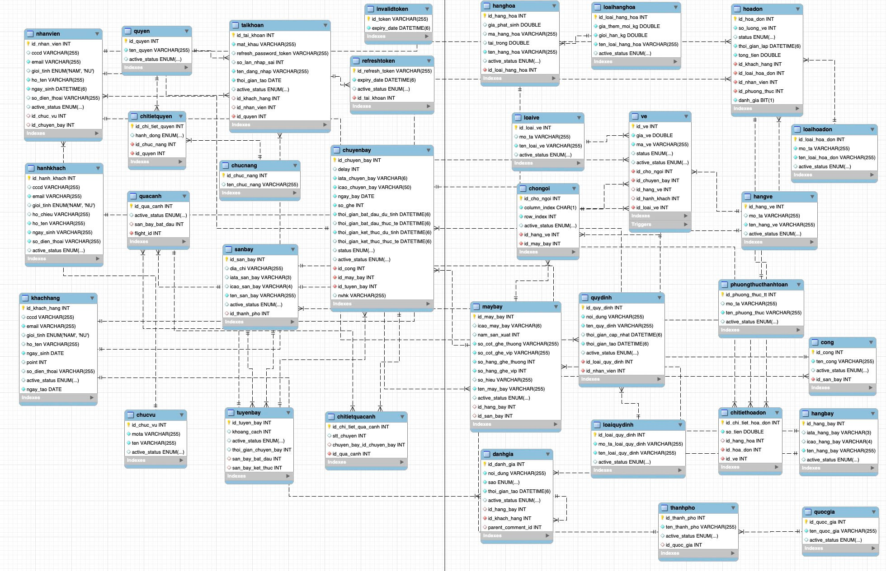
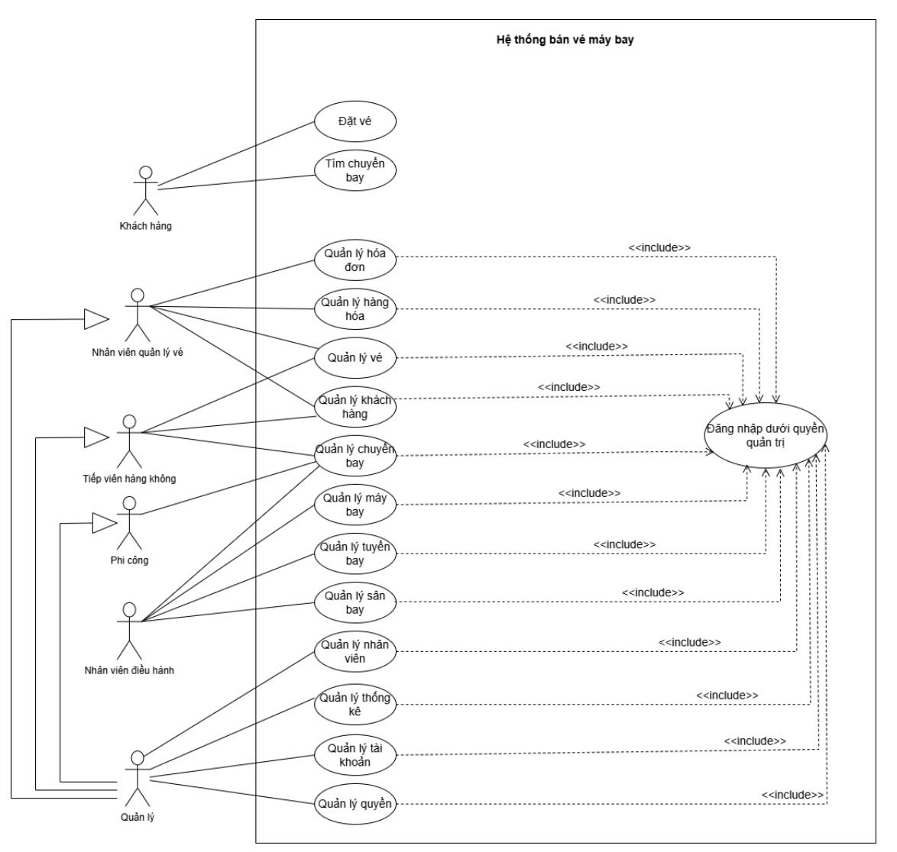
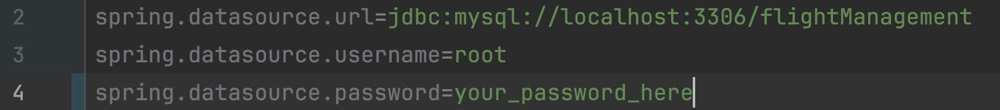

# Flight Management System - Backend ✈️
## Introduction

The backend for the Flight Management System, developed with Spring Boot, 
offers essential services for managing flight bookings, including authentication, 
role-based access control, payment integration,
and real-time updates through WebSocket support.

---

## Documentation

For a comprehensive overview of the entire system, including database design, user interface, diagrams (such as use case and sequence diagrams), and more, please refer to the PDF documentation:

[Flight Management System - Full Documentation (PDF)](https://drive.google.com/file/d/1BDc8DDDpu4samsUlvakGer13PF76pAz0/view?usp=sharing)

This document covers the following topics:
- Database schema and relationships
- System architecture
- Use case and sequence diagrams, activity diagram, dfd, bfd, erd
- UI/UX design
- Testcase
- Implementation details
- System advantages, limitations, and future development directions
## Features
- 🔒 **Secure JWT authentication**
- 💳 **VNPay payment integration**
- 📊 **Excel export for reporting**
- 🛋️ **Real-time seat updates with WebSocket**
- 📧 **Email notifications**
- 📑 **PDF ticket generation**
---
## Technologies
- **Framework**: Spring Boot
- **Authentication**: JWT, Spring Security
- **Database**: MySQL
- **Payment Integration**: VNPay
- **Real-time Communication**: WebSocket
- **Data Visualization**: Excel export
- **Build Tool**: Maven
- **Email**: JavaMailSender
- **PDF Generation**: iText
---
## Database Schema

---
## Use-case overall

---
## Installation

### Prerequisites
- **Java JDK 21+**
- **Maven 3.8+**
- **MySQL 8.0+**
- **IntelliJ IDEA**

### Installation Guide
#### 1. Clone the Repository
```bash
git clone https://github.com/kietsocola/FlightManagementSystem.git
```
#### 2. Set Up the Database

##### 2.1 Import the SQL File
- In the project directory, locate the `backupFlight_28_11_24.sql` file
- Open **MySQL Workbench** (or any other database management tool) and import the SQL file into your database
##### 2.2 Configure Database Connection
- Open the application.properties file located in src/main/resources.
- Update the database connection settings, specifically the username and password fields:
- 
  **Note:** _If you’re using a different database or user credentials, please update these values accordingly._

#### 3. Set Up the Project in IntelliJ IDEA
##### 3.1 Open the Project
- Open IntelliJ IDEA
- Go to file `FlightManagementApplication` located in src/main and run project
##### 3.2 Install Lombok Plugin (if needed)
If you encounter errors related to Lombok (such as “cannot resolve symbol @Data”), it might be because the Lombok plugin is not installed in IntelliJ IDEA. To install it:
1.	Open Settings (or Preferences on macOS): File -> Settings (or IntelliJ IDEA -> Preferences on macOS).
2.	In the Settings window, navigate to Plugins and search for Lombok.
3.	Click Install next to the Lombok plugin, and restart IntelliJ IDEA.
---
## API Documentation

You can access the API documentation for the Flight Management System at the following link:

[Flight Management System API Documentation](http://14.225.255.160:8080/swagger-ui/index.html#/)

Please refer to this documentation for all available API endpoints and usage details.

userName: `admin`
password: `123456`
---
## Frontend

To experience the frontend of the Flight Management System, please visit the following GitHub repository:

[Flight Management System Frontend Repository](https://github.com/duylam15/FE-datvemaybay)